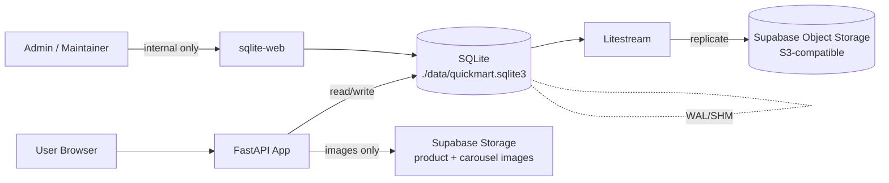

# SQLite Migration Plan

This plan operationalizes [draft.md](PLAN/migrate-sqlite/draft.md). The Builder should follow it top-to-bottom; sections are ordered so that no step depends on a later step.

## Source of Truth

- Schema: the Supabase DDL captured in conversation, mapped to SQLite below.
- App-active tables in scope: `products`, `categories`, `sold_items`, `sold_sessions`, `search_selections`, `feedback_messages`.
- Out of scope tables (do not create in SQLite): `events`, `event_code`, `orders`, `order_items`, `sessions`, `schema_migrations`, `search_logs`.

## Architecture Overview



Single host. Single writer (the FastAPI app). Litestream is backup-only.

## Postgres → SQLite Type Mapping

| Postgres                | SQLite                                            | Notes |
|-------------------------|---------------------------------------------------|-------|
| `serial4` / `bigserial` | `INTEGER PRIMARY KEY AUTOINCREMENT`               | One PK per table |
| `int4`                  | `INTEGER`                                         | |
| `varchar(N)` / `text`   | `TEXT`                                            | SQLite ignores length |
| `float4`                | `REAL`                                            | |
| `timestamptz`           | `TEXT` ISO-8601 UTC, default `CURRENT_TIMESTAMP`  | Always store UTC |
| `timestamp`             | `TEXT`, default `CURRENT_TIMESTAMP`               | |
| `inet`                  | `TEXT`                                            | Plain string |
| `uuid`                  | `TEXT`                                            | App-generated when needed |
| `bpchar(1)` + check     | `TEXT` + `CHECK (col IN ('Y','N'))`               | Preserve domain check |
| `NOW()`                 | `CURRENT_TIMESTAMP`                               | Or set in Python |
| `ON CONFLICT DO NOTHING`| `INSERT OR IGNORE`                                | |
| `ILIKE`                 | `LIKE` with `COLLATE NOCASE`                      | |
| `id = ANY(%s)`          | `id IN (?, ?, …)` with dynamic placeholders       | |
| `CONCAT_WS(' ', a, b)`  | `TRIM(COALESCE(a,'') \|\| ' ' \|\| COALESCE(b,''))`| Or compute in Python |
| `RealDictCursor` rows   | `sqlite3.Row` with `row_factory = sqlite3.Row`    | Same `row['col']` access |

## Discovery (verified)

- DB layer to replace: [app/db/database.py](app/db/database.py)
- DB env config to update: [app/config.py](app/config.py#L29-L33)
- Startup DB validation: [app/main.py](app/main.py#L36-L50)
- Admin SQL (uses `ILIKE`, `NOW()`, `IntegrityError`, `products_name_key`): [app/routes/admin.py](app/routes/admin.py#L84) and [app/routes/admin.py](app/routes/admin.py#L218-L226)
- Search SQL (uses `ANY(%s)`): [app/routes/products.py](app/routes/products.py#L130-L135)
- Search selection insert: [app/routes/products.py](app/routes/products.py#L20-L42)
- Cart/checkout writes through helpers: [app/db/database.py](app/db/database.py#L78-L120) called from [app/routes/main.py](app/routes/main.py#L227-L250)
- Feedback insert: [app/routes/main.py](app/routes/main.py#L256-L275)
- Product cache (uses `CONCAT_WS`, `COUNT(*)` returning `row['count']`): [app/utils/product_cache.py](app/utils/product_cache.py#L20-L60)
- Container build context: [Dockerfile](Dockerfile)
- Dependency manifest (currently lists `psycopg2-binary` and already lists `aiosqlite`): [pyproject.toml](pyproject.toml)

## SQLite Schema Definition

Builder creates `app/db/schema.sql` containing the SQLite DDL below. The app loads and executes this at startup if the database file is missing or empty.

```sql
PRAGMA foreign_keys = ON;

CREATE TABLE IF NOT EXISTS categories (
    id INTEGER PRIMARY KEY AUTOINCREMENT,
    name TEXT NOT NULL UNIQUE,
    parent_id INTEGER NULL,
    FOREIGN KEY (parent_id) REFERENCES categories(id)
);
CREATE INDEX IF NOT EXISTS categories_index_0 ON categories(name);

CREATE TABLE IF NOT EXISTS products (
    id INTEGER PRIMARY KEY AUTOINCREMENT,
    barcode TEXT NULL,
    name TEXT NOT NULL UNIQUE,
    brand TEXT NULL,
    price INTEGER NOT NULL DEFAULT 1,
    unit TEXT NULL,
    stock INTEGER DEFAULT 0,
    description TEXT NULL,
    category_id INTEGER NULL,
    keyword TEXT NULL,
    image_url TEXT NULL,
    created_at TEXT DEFAULT CURRENT_TIMESTAMP,
    updated_at TEXT DEFAULT CURRENT_TIMESTAMP,
    purchase_price INTEGER NULL,
    latest_price INTEGER NULL,
    FOREIGN KEY (category_id) REFERENCES categories(id)
);
CREATE INDEX IF NOT EXISTS idx_products_category_id ON products(category_id);
CREATE INDEX IF NOT EXISTS products_index_1 ON products(name);
CREATE INDEX IF NOT EXISTS products_index_2 ON products(barcode);

CREATE TABLE IF NOT EXISTS sold_sessions (
    id INTEGER PRIMARY KEY AUTOINCREMENT,
    session_id TEXT NOT NULL UNIQUE,
    ip_address TEXT NULL,
    user_agent TEXT NULL,
    device_type TEXT NULL,
    browser TEXT NULL,
    os TEXT NULL,
    country TEXT NULL,
    created_at TEXT DEFAULT CURRENT_TIMESTAMP
);
CREATE INDEX IF NOT EXISTS idx_sold_sessions_country ON sold_sessions(country);
CREATE INDEX IF NOT EXISTS idx_sold_sessions_created_at ON sold_sessions(created_at);
CREATE INDEX IF NOT EXISTS idx_sold_sessions_ip_address ON sold_sessions(ip_address);
CREATE INDEX IF NOT EXISTS idx_sold_sessions_session_id ON sold_sessions(session_id);

CREATE TABLE IF NOT EXISTS sold_items (
    id INTEGER PRIMARY KEY AUTOINCREMENT,
    session_id TEXT NOT NULL,
    item_id INTEGER NOT NULL,
    item_name TEXT NOT NULL,
    price_at_purchase REAL NOT NULL,
    quantity INTEGER NOT NULL,
    total_price REAL NOT NULL,
    timestamp TEXT DEFAULT CURRENT_TIMESTAMP,
    FOREIGN KEY (item_id) REFERENCES products(id)
);
CREATE INDEX IF NOT EXISTS idx_sold_items_item_id ON sold_items(item_id);
CREATE INDEX IF NOT EXISTS idx_sold_items_session_id ON sold_items(session_id);

CREATE TABLE IF NOT EXISTS search_selections (
    id INTEGER PRIMARY KEY AUTOINCREMENT,
    session_id TEXT NULL,
    product_id INTEGER NOT NULL,
    product_name TEXT NULL,
    search_query TEXT NULL,
    ip_address TEXT NULL,
    selected_at TEXT DEFAULT CURRENT_TIMESTAMP
);
CREATE INDEX IF NOT EXISTS idx_search_selections_selected_at ON search_selections(selected_at);

CREATE TABLE IF NOT EXISTS feedback_messages (
    id INTEGER PRIMARY KEY AUTOINCREMENT,
    session_id TEXT NOT NULL,
    message TEXT NOT NULL,
    ip_address TEXT NULL,
    user_agent TEXT NULL,
    created_at TEXT DEFAULT CURRENT_TIMESTAMP,
    is_deleted TEXT DEFAULT 'N' CHECK (is_deleted IN ('Y','N'))
);
CREATE INDEX IF NOT EXISTS idx_fm_created_at ON feedback_messages(created_at);
CREATE INDEX IF NOT EXISTS idx_fm_ip_address ON feedback_messages(ip_address);
CREATE INDEX IF NOT EXISTS idx_fm_is_deleted ON feedback_messages(is_deleted);
CREATE INDEX IF NOT EXISTS idx_fm_session_id ON feedback_messages(session_id);
```

## SQLite Runtime Settings

Builder sets these PRAGMAs on every new connection in the DB layer:

- `PRAGMA journal_mode = WAL;`
- `PRAGMA foreign_keys = ON;`
- `PRAGMA synchronous = NORMAL;`
- `PRAGMA busy_timeout = 5000;`
- `PRAGMA temp_store = MEMORY;`

Reference: [SQLite PRAGMA docs](https://www.sqlite.org/pragma.html).

## File Layout

```
app/
  db/
    database.py        # rewritten: sqlite3-backed
    schema.sql         # NEW: SQLite DDL above
data/                  # NEW: runtime DB dir at repo root, git-ignored
  .gitkeep
migrations/
  import_from_supabase.py  # NEW: one-shot data import script
docker-compose.yml     # NEW
litestream.yml         # NEW
.gitignore             # update
```

## Builder Checklist

### 1. Schema and runtime DB directory

- [ ] [Builder] Create [app/db/schema.sql](app/db/schema.sql) with the DDL in the *SQLite Schema Definition* section.
- [ ] [Builder] Create directory `data/` at repo root containing only an empty `.gitkeep`. This directory is bind-mounted to `/data/` in every Compose service and holds the SQLite DB file plus its WAL/SHM sidecar files.
- [ ] [Builder] Update [.gitignore](.gitignore) to add:
  ```
  data/*
  !data/.gitkeep
  ```

### 2. Config changes

- [ ] [Builder] In [app/config.py](app/config.py), remove unused `PG_*` variables and add:
  ```python
  SQLITE_DIR: str = os.getenv("SQLITE_DIR", "data")
  SQLITE_PATH: str = os.getenv("SQLITE_PATH", f"{SQLITE_DIR}/quickmart.sqlite3")
  ```
- [ ] [Builder] Keep all `S3_*` / `AWS_*` config untouched (still used for images and Litestream).

### 3. Rewrite the DB layer

- [ ] [Builder] Rewrite [app/db/database.py](app/db/database.py):
  - Drop `psycopg2`, `RealDictCursor`, and all `PG_*` imports.
  - Add `get_db() -> Generator[sqlite3.Connection, None, None]`:
    - Open with `sqlite3.connect(SQLITE_PATH, isolation_level=None, check_same_thread=False)` to enable autocommit-style commits where appropriate, OR keep default and call `conn.commit()` explicitly (preferred — matches existing code shape).
    - Set `conn.row_factory = sqlite3.Row` so `row['col']` keeps working.
    - Apply all PRAGMAs from *SQLite Runtime Settings*.
  - Add a one-time `init_db()` that creates `SQLITE_DIR` if missing and runs `schema.sql` when `products` table is absent.
  - Keep the existing public function names so call sites do not change shape:
    - Rename `get_pg_db` → `get_db`. Update every import site.
    - Reimplement `insert_transaction`, `insert_transactions_batch`, `insert_sold_session` against SQLite using `?` placeholders and `INSERT OR IGNORE` for sessions.

### 4. Update routes for SQLite SQL differences

- [ ] [Builder] [app/routes/admin.py](app/routes/admin.py):
  - Replace `from app.db.database import get_pg_db` with `get_db`. Replace `for conn in get_pg_db()` loops accordingly.
  - Replace `from psycopg2 import IntegrityError` with `from sqlite3 import IntegrityError`.
  - Detect duplicate-name violations by string match on `"products.name"` and `"UNIQUE constraint failed"` instead of `products_name_key`.
  - Replace `%s` with `?` in every SQL string in this file.
  - In the search query, replace `WHERE name ILIKE %s` with `WHERE name LIKE ? COLLATE NOCASE`.
  - In the update query, replace `updated_at = NOW()` with `updated_at = CURRENT_TIMESTAMP`.
- [ ] [Builder] [app/routes/products.py](app/routes/products.py):
  - Replace `%s` with `?` in every SQL string.
  - Replace `WHERE id = ANY(%s)` with a dynamic IN clause:
    ```python
    placeholders = ",".join("?" * len(ranked_ids))
    cursor.execute(
        f"SELECT id, barcode, name, image_url FROM products WHERE id IN ({placeholders})",
        ranked_ids,
    )
    ```
  - **Preserve ranked order.** SQLite returns `IN` results in arbitrary order; keep the existing `row_map` + `ordered_results = [row_map[pid] for pid in ranked_ids if pid in row_map]` reorder block at [app/routes/products.py](app/routes/products.py#L138-L143) intact so the response still follows fuzzy-search ranking.
  - Update `log_search_selection` insert to use `?` placeholders.
- [ ] [Builder] [app/routes/main.py](app/routes/main.py):
  - Update the feedback insert to use `?` placeholders.
- [ ] [Builder] [app/utils/product_cache.py](app/utils/product_cache.py):
  - Replace `cursor.fetchone()['count']` with `cursor.fetchone()[0]` (alias the column or use positional access).
  - Replace `CONCAT_WS(' ', name, keyword)` with `TRIM(COALESCE(name,'') || ' ' || COALESCE(keyword,''))` aliased as `searchable_text`.

### 5. Startup behavior

- [ ] [Builder] Update [app/main.py](app/main.py) lifespan:
  - Replace the `get_pg_db()` validation block with: ensure `SQLITE_DIR` exists, call `init_db()` (idempotent), open one connection, run `SELECT 1`. Fail loudly on error (no silent errors).

### 6. Dependencies

- [ ] [Builder] In [pyproject.toml](pyproject.toml), remove `psycopg2-binary`. Keep `aiosqlite` only if it is actually used; otherwise remove it. Built-in `sqlite3` is sufficient. Re-lock with `uv lock`.

### 7. Data import from Supabase (one-shot)

- [ ] [Builder] Create `migrations/import_from_supabase.py` that:
  - Reads Postgres connection from env (`PG_HOST`, `PG_PORT`, `PG_DATABASE`, `PG_USER`, `PG_PASSWORD`).
  - Reads SQLite path from `SQLITE_PATH`.
  - **First-run requirement:** SQLite DB must be empty for in-scope tables. Any pre-existing PK collision aborts the script with a non-zero exit.
  - **Preserve primary keys.** Insert `id` explicitly so existing FK relationships (`sold_items.item_id -> products.id`, `products.category_id -> categories.id`) stay valid.
  - **Disable FK checks during load:** open the SQLite connection with `PRAGMA foreign_keys = OFF` so historical orphan rows in `sold_items` are preserved. After load, run `PRAGMA foreign_key_check` and log any orphans for visibility (do not delete).
  - For each in-scope table in this order (parents first): `categories`, `products`, `sold_sessions`, `sold_items`, `search_selections`, `feedback_messages`.
  - Streams rows in batches (e.g. 1000) using `INSERT OR IGNORE` so re-runs against an already-imported DB are no-ops.
  - After load, for each AUTOINCREMENT table, update `sqlite_sequence` to `MAX(id)` so future inserts get unique IDs:
    ```sql
    INSERT INTO sqlite_sequence(name, seq) VALUES (?, ?)
      ON CONFLICT(name) DO UPDATE SET seq = excluded.seq;
    ```
  - Converts `inet` and `uuid` to TEXT, normalizes `timestamptz` to ISO-8601 UTC strings.
  - Logs per-table row counts at the end and exits non-zero on any failure.
- [ ] [Builder] Document invocation in the script header:
  ```bash
  uv run python migrations/import_from_supabase.py
  ```

### 8. Litestream (backup only)

- [ ] [Builder] Create `litestream.yml` at repo root. **Backup bucket is dedicated and separate from the image bucket**:
  ```yaml
  dbs:
    - path: /data/quickmart.sqlite3
      replicas:
        - type: s3
          endpoint: ${S3_ENDPOINT_URL}
          bucket: sqlite-backup
          path: litestream/quickmart
          region: ${S3_REGION}
          access-key-id: ${AWS_ACCESS_KEY_ID}
          secret-access-key: ${AWS_SECRET_ACCESS_KEY}
          force-path-style: true
          sync-interval: 1h
          snapshot-interval: 24h
          retention: 72h
  ```
- [ ] [Builder] Sync cadence rationale: this app is light-usage and not business-critical. `sync-interval: 1h` accepts an RPO of up to ~1 hour in exchange for far fewer S3 writes. `snapshot-interval: 24h` and `retention: 72h` keep three days of recoverable history.
- [ ] [Builder] The Supabase S3 endpoint shape is `https://<project_id>.storage.supabase.co/storage/v1/s3` (same value the app already uses at [app/config.py](app/config.py#L10)). Do **not** use `${S3_BUCKET_NAME}` here — that is the image bucket.
- [ ] [Builder] Create the `sqlite-backup` bucket in Supabase Storage before first run.
- [ ] [Builder] Reference: [Litestream + S3-compatible config](https://litestream.io/guides/s3/).

### 9. Docker Compose deployment

- [ ] [Builder] Keep [Dockerfile](Dockerfile) for the app image. Remove the commented `COPY migrations/` line if migrations are not needed inside the container, or uncomment if the import script ships with the image.
- [ ] [Builder] Create `docker-compose.yml` with four services. The host directory `./data` is bind-mounted to `/data` in every service. The DB file lives at `./data/quickmart.sqlite3` on host and `/data/quickmart.sqlite3` in containers.
  - `restore` (init container, one-shot): `litestream/litestream` image, mounts `./data:/data` and `./litestream.yml`. Command: `restore -if-replica-exists -if-db-not-exists /data/quickmart.sqlite3`. Exits 0 on success. Provides the readiness gate for the rest of the stack.
  - `app`: builds from `Dockerfile`, mounts `./data:/data`, sets `SQLITE_PATH=/data/quickmart.sqlite3`. Uses `depends_on: { restore: { condition: service_completed_successfully } }`.
  - `litestream`: `litestream/litestream` image, mounts `./data:/data` and `./litestream.yml`. Command: `replicate`. Uses `depends_on: { restore: { condition: service_completed_successfully } }`.
  - `sqlite-web`: image `coleifer/sqlite-web`, mounts `./data:/data`, command points at `/data/quickmart.sqlite3`. Port mapping must bind to **`127.0.0.1`** only (e.g. `"127.0.0.1:8080:8080"`) so it stays internal-only.
- [ ] [Builder] All Supabase S3 env vars are passed through from the host or `.env`.

### 10. Cutover

- [ ] [Builder] Run the app once locally so `init_db()` creates an empty SQLite DB at `./data/quickmart.sqlite3`.
- [ ] [Builder] Run `migrations/import_from_supabase.py` against production Supabase to populate the SQLite file.
- [ ] [Builder] Bring up the full stack via `docker compose up -d`. Confirm Litestream begins replicating to Supabase Storage at `litestream/quickmart`.
- [ ] [Builder] Stop pointing the app at Supabase Postgres (env vars no longer needed by app code; remove from deployment).

### 11. QA

- [ ] [QA] Cold start: delete `./data/quickmart.sqlite3`, start the app, confirm `init_db()` creates schema and `SELECT 1` succeeds in the lifespan log.
- [ ] [QA] Admin login at `/admin/products` works with `ADMIN_PASSWORD`.
- [ ] [QA] Admin search uses case-insensitive `LIKE` and returns expected rows for mixed-case queries.
- [ ] [QA] Admin add: inserting a product with a duplicate `name` produces the existing "Product name already exists!" toast (verifies SQLite `IntegrityError` path).
- [ ] [QA] Admin edit updates `updated_at` to a newer timestamp than `created_at`.
- [ ] [QA] Admin delete removes a row and `product_cache.invalidate()` causes next search to refresh.
- [ ] [QA] Public catalog `/catalog` renders products from SQLite.
- [ ] [QA] Search `/search?q=...` returns ranked results and the IN-clause query returns rows in the order produced by `product_cache.fuzzy_search`.
- [ ] [QA] Selecting a search result fires `/api/log-search-selection` and a row appears in `search_selections`.
- [ ] [QA] Checkout flow inserts N rows into `sold_items` (batch insert) and one row into `sold_sessions` with `INSERT OR IGNORE` semantics on duplicate `session_id`.
- [ ] [QA] Feedback POST inserts a row into `feedback_messages` with `is_deleted='N'`.
- [ ] [QA] Restart the container: data persists (volume confirmed).
- [ ] [QA] Litestream replication: within ~70 minutes of a write (matches `sync-interval: 1h` plus buffer), `litestream snapshots /data/quickmart.sqlite3` lists at least one snapshot in the `sqlite-backup` bucket. For faster manual validation, restart the `litestream` service or run `litestream replicate --once` and verify a snapshot appears.
- [ ] [QA] Disaster recovery: with the volume wiped, `litestream restore` reproduces the database from Supabase Storage and the app starts normally.
- [ ] [QA] `sqlite-web` is reachable on `127.0.0.1` only and not from external interfaces.
- [ ] [QA] WAL is active: `PRAGMA journal_mode;` returns `wal` from inside an opened app connection.
- [ ] [QA] Foreign keys enforced: inserting a `sold_items` row with an `item_id` that does not exist in `products` is rejected.

## Out-of-Scope Reminders

- No migration of `events`, `event_code`, `orders`, `order_items`, `sessions`, `schema_migrations`, `search_logs`.
- No multi-writer or HA. Litestream is backup/restore only.
- No custom admin DB editor in the app — that role is filled by `sqlite-web` running internally.
